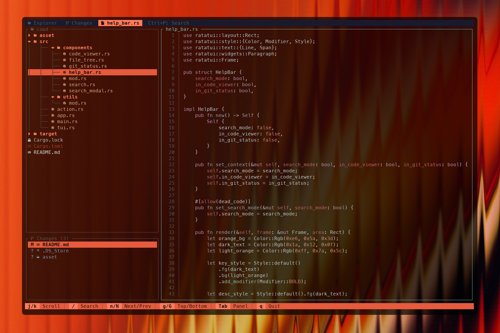

# cawd

Code Aware Workspace Display — the terminal for **reviewing and orchestrating AI-generated code**.



## Why cawd?

When an AI assistant (Claude Code, Cursor, Copilot…) writes code for you, the bottleneck is no
longer typing — it's **reading, judging, and steering** what gets produced. cawd is built for that
loop: a fast, always-visible terminal where you read the generated code, mark what's wrong, and fire
off fixes without ever leaving the keyboard.

Run it in a split terminal next to your AI tool and treat it as your **control tower**: watch files
change in real time, annotate the parts that need work, and dispatch workers to resolve them — then
verify the result, all in one place.

The loop cawd is designed around:

1. **Read** — browse the tree and read generated code with syntax highlighting.
2. **Track changes** — see every file that was just modified and inspect the diff, side by side.
3. **Annotate** — select the lines that are wrong and leave a comment, pinned right on the code.
4. **Dispatch** — send a headless worker to fix the annotation for you, ultra fast.
5. **Verify** — the annotation flips to _resolved_ when the worker succeeds; you review the result.

## Install

```bash
cargo install --path cawd
```

## Usage

```bash
cawd [path]
```

Switch panels by clicking, pressing `Tab`, or jumping straight to one with the number keys:
`1` Explorer · `2` Changes · `3` Review · `4` the open file.

## Reviewing changes

The **Changes** panel (press `2`) lists every file you've modified in the working tree and lets you
open a side-by-side diff with additions and deletions highlighted — a quick way to see exactly what
the AI just touched before you accept it, without leaving the terminal.

## Annotate & dispatch


In the code viewer, drag with the mouse to select one or more lines, then press `c` to write a
comment. The annotation is saved to a timestamped markdown file under `.cawd/` at the project root,
capturing the file path, line range, the selected code excerpt, and your note.

Once saved, the annotated lines are highlighted **directly in the code** — the range gets a
status-colored background and your comment is shown inline on the first line (amber = open, blue = in
progress, green = done) — so you can see at a glance which lines a note refers to while reading.

The **Review** panel (press `3`) is your task board: it lists every annotation with a status badge
(○ open · ◐ in progress · ● resolved) on top, and the live workers below. Resolved annotations are
hidden by default — the title shows how many are _done_ and `a` reveals them.

| Key   | Action                                       |
| ----- | -------------------------------------------- |
| j/k   | Navigate annotations                         |
| Enter | Open the annotated file at its lines         |
| w     | Dispatch a worker on the annotation          |
| s     | Cycle status (open → in progress → resolved) |
| a     | Show / hide resolved annotations             |
| d     | Delete the annotation                        |

Pressing `w` launches a **headless Claude Code worker** (`claude -p … --dangerously-skip-permissions`)
from the project root. It picks up a task built from your comment, the code excerpt and the line
range, and gets to work. The annotation moves to _in progress_; when the worker exits cleanly it is
marked _resolved_ automatically (otherwise it returns to _open_). Worker output is streamed to
`.cawd/logs/<id>.log`.

This is the core idea: cawd turns your review notes into dispatched work and tracks each one through
to done — an orchestration and verification cockpit for AI-assisted coding.

> Note: workers edit files directly in the repository without confirmation. They run as child
> processes of cawd, so quitting cawd stops any in-flight workers.

## Keybindings

| Key           | Action                                     |
| ------------- | ------------------------------------------ |
| 1 / 2 / 3 / 4 | Jump to Explorer / Changes / Review / file |
| j/k           | Navigate                                   |
| h/l           | Collapse/Expand                            |
| Enter         | Open file                                  |
| Ctrl+P        | Search files                               |
| /             | Filter/Search                              |
| Mouse drag    | Select lines (code viewer)                 |
| c             | Comment selected lines                     |
| Tab           | Switch panel                               |
| q             | Quit                                       |
